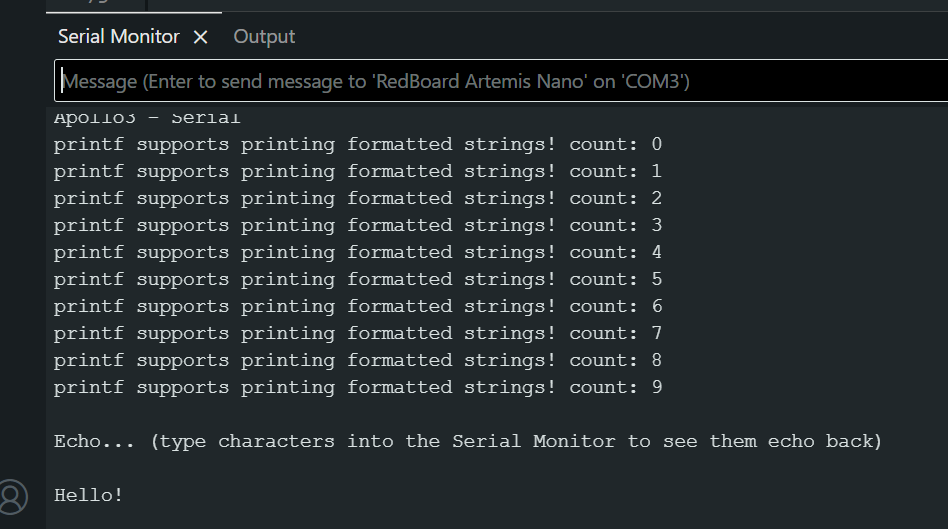
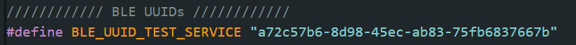
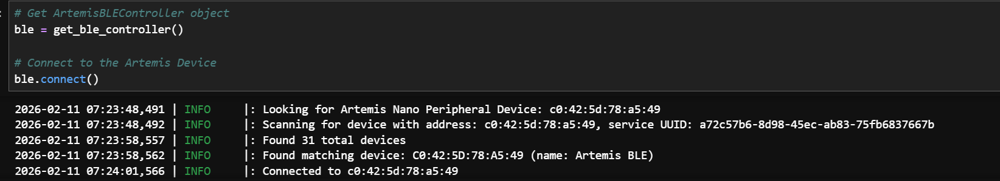
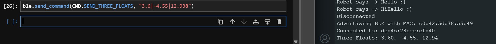

## 1a

For section 1A, I had to install the Arduino IDE and connect to the Artemis Nano microcontroller. I connected to the Artemis board using a USB cable to where I then selected the board through the Arduino IDE and tested various examples from the IDE.

#### Blink
The Artemis board flashes a blue LED every second.
<iframe width="450" height="315" src="https://youtube.com/embed/MrdPBHumuyY"allowfullscreen></iframe>
<figcaption>Blink test</figcaption>

#### Serial
Here we can see the Artemis recieves the string and echos it back

<figcaption>Serial output test</figcaption>

#### analogRead Temperature Sensor
As I hold the board, the temperature increases from consistent 33100 readings to 33300 readings.
<iframe width="450" height="315" src="https://youtube.com/embed/VmS2qm2H8vI"allowfullscreen></iframe>
<figcaption>Temperature sensor test</figcaption>

#### Microphone Output
You can see the values of ambient noise and then a jump in frequency as I provide sound. 
<iframe width="450" height="315" src="https://youtube.com/embed/poW4jzCsWfI"allowfullscreen></iframe>
<figcaption>Microphone test</figcaption>

## 1b

#### Codebase and BLE 

Bluetooth Low Energy is used for the connection between my latop and Artemis board. 

BLE radio acts like a community bulletin board where computers act ascommunity members and can connect to read the board. If the radio is a bulletin board, it's called a peripheral device. The Artemis scts as the bulletin board and is responsible for posting data. If the radio is a reader it reads from any of the bulletin boards.

A peripheral provides services, which in turn provides characteristics. Services are identified by unique numbers known as UUIDs. Bluetooth acts on mulitple layers, and the General Attribute Profile (GATT) is what defines services and characteristics.

The codebase has various Python and Arduino packages along with code files to help establish a Bluetooth connection with the Artemis board.

- Important functions used to communicate between the computer and Artemis:
    - `send_command(cmd_type, data)` to send a command
    - `ble.connect()` and `ble.disconnect` to connect with the Artemis
    - `receive_string(uuid)` to recieve a string from our board
    - `start_notify(uuid, notification_handler)` to activate the notification handler

#### Configurations and Setup
1. I installed venv: `python3 -m pip install --user virtualenv`

2. I created the "FastRobots_ble" virtual environment: `python3 -m venv FastRobots_ble`

3. I activated the virtual environment: source `FastRobots_ble/bin/activate`

3. I downloaded python packages: `pip install numpy pyyaml colorama nest_asyncio bleak jupyterlab` and the provided ble_robot_1.4 codebase into my project directory

4. Then I started the Jupyter server: `jupyter lab`

5. I updated the Artemis MAC Address in connections.yaml using the provided one: `artemis_address: 'C0:C2:8A:89:98:08'`

6. I generated a new UUID: run `from uuid import uuid4` and `uuid4()`. I input the generated UUID into the `#define BLE_UUID_TEST_SERVICE` line in ble_arduino.ino and into the `ble_service:` line in connections.yaml


<figcaption>New UUID</figcaption>

7. Connect to the Artemis Nano via BLE

```python
ble = get_ble_controller()

ble.connect()
```


<figcaption>Successful BLE Connection</figcaption>

#### Task 1
I sent a string value from my computer to the Artemis board using the `ECHO` command and the computer recieved and printed the string.

Arduino Code:
```c++ 
case ECHO:

    char char_arr[MAX_MSG_SIZE];

    // Extract the next value from the command string as a character array
    success = robot_cmd.get_next_value(char_arr);
    if (!success)
        return;

    Serial.print("Robot says -> ");
    Serial.print(char_arr);
    Serial.println(" :)");
    
    break;
```

Jupyter Code: 
```python
ble.send_command(CMD.ECHO, "Hello")
ble.send_command(CMD.ECHO, "HiHello")
```


<figcaption>ECHO Output</figcaption>


#### Task 2
I sent three floats to the Artemis board using the `SEND_THREE_FLOATS` command and extracted the three floats in the Arduino sketch

Arduino Code:
```c++
case SEND_THREE_FLOATS:
    float float_a, float_b, float_c;

    // Extract the next value from the command string as an float
    success = robot_cmd.get_next_value(float_a);
    if (!success)
        return;

    // Extract the next value from the command string as an float
    success = robot_cmd.get_next_value(float_b);
    if (!success)
        return;

    // Extract the next value from the command string as an float
    success = robot_cmd.get_next_value(float_c);
    if (!success)
        return;

    Serial.print("Three Floats: ");
    Serial.print(float_a);
    Serial.print(", ");
    Serial.print(float_b);
    Serial.print(", ");
    Serial.println(float_c);

    break;
```

Jupyter Code:
```python
ble.send_command(CMD.SEND_THREE_FLOATS, "3.6|-4.55|12.938")
```

<figcaption>SEND_THREE_FLOATS Output</figcaption>

#### Task 3
I added a `GET_TIME_MILLIS` command which makes the robot reply write a string to the string characteristic. This has the same output as shown in Task 4.

```c++
case GET_TIME_MILLIS:
    tx_estring_value.clear();
    tx_estring_value.append("T:");
    tx_estring_value.append((int) millis());
    tx_characteristic_string.writeValue(tx_estring_value.c_str());

    Serial.print("Sent back: ");
    Serial.println(tx_estring_value.c_str());
    break;
```

#### Task 4
I setup a `notification_handler` function to receive the string value from the Artemis board and, in the callback function, extract the time from the string.

Jupyter Code:
```python
def notification_handler(uuid, notif):
    string = ble.bytearray_to_string(notif)
    print(string)
```
```python
ble.start_notify(ble.uuid['RX_STRING'], notification_handler)
ble.send_command(CMD.GET_TIME_MILLIS, "time")
```


<figcaption>Notification Handler Output</figcaption>

#### Task 5
I made a loop called `GET_TIME_LOOP` that gets the current time over 5 seconds using the `GET_TIME_MILLIS` function to then be processed by `notification_handler()`. With this method, I took the first and last time received by my notification handler and changed the time difference into a byte rate. From this I got a byte rate of **80 bytes per second**.

Arduino Code:
```c++
case GET_TIME_LOOP:
    int starting_millis;
    starting_millis = (int) millis();
    while ((int) millis() - starting_millis < 5000) {
    tx_estring_value.clear();
    tx_estring_value.append("T:");
    tx_estring_value.append((int) millis());
    tx_characteristic_string.writeValue(tx_estring_value.c_str());

    Serial.print("Sent back: ");
    Serial.println(tx_estring_value.c_str());
    }

    break;
```

Jupyter Code:
```python
ble.start_notify(ble.uuid['RX_STRING'], notification_handler)
ble.send_command(CMD.GET_TIME_LOOP, "loop")
```
```python
byte_rate = 400 / ((356529 - 351554) / 1000)
print(byte_rate)
```


<figcaption>GET_TIME_MILLIS Loop Output</figcaption>

#### Task 6
I created a command `SEND_TIME_DATA` that loops through to add generated time steps via the `millis()` function to an array. Then, in `GET_ARRAY` I loop through the array and send each data point as a string to my laptop. `time_array[TIME_SAMPLES]` is defined as a global array where `TIME_SAMPLES = 1000`.

Arduino Code:
```c++
case GET_TIME_ARRAY:
    int i;
    for (i = 0; i < TIME_SAMPLES; i++) {
        time_array[i] = (int) millis();
    }
    Serial.print(i);
    Serial.println(" time samples received.");
    break;

case SEND_TIME_DATA:
    int j;
    for (j = 0; j < TIME_SAMPLES; j++) {
        tx_estring_value.clear();
        tx_estring_value.append("T:");
        tx_estring_value.append(time_array[j]);
        tx_characteristic_string.writeValue(tx_estring_value.c_str());
    }
    Serial.print("Sent back: ");
    Serial.print(j);
    Serial.println(" messages.");
    break;
```

Jupyter Code:
```python
ble.start_notify(ble.uuid['RX_STRING'], notification_handler)
ble.send_command(CMD.GET_TIME_ARRAY, "array")
ble.send_command(CMD.SEND_TIME_DATA, "data")
```


<figcaption>SEND_TIME_DATA Output</figcaption>

#### Task 7
I created a second array to store temperature readings with the same length as the one used in Task 6. The command `GET_TEMP_READINGS` loops through both arrays concurrently and sends each temperature reading with a time stamp. The notification handler parses these strings and populates the data into two lists. `GET_ARRAY` was also changed to `GET_ARRAYS` to add in the new temperature array.

Arduino Code:
```c++
case GET_ARRAYS:
    int i;
    for (i = 0; i < TIME_SAMPLES; i++) {
        time_array[i] = (int) millis();
        temp_array[i] = (int) getTempDegF();
    }
    Serial.print(i);
    Serial.println(" time samples received.");
    break;

case GET_TEMP_READINGS:
    for (i = 0; i < TIME_SAMPLES; i++) {
        tx_estring_value.clear();
        tx_estring_value.append("Temp: ");
        tx_estring_value.append(temp_array[i]);
        tx_estring_value.append(" at time:");
        tx_estring_value.append(time_array[i]);
        tx_characteristic_string.writeValue(tx_estring_value.c_str());
    }
    Serial.print("Sent back: ");
    Serial.print(i);
    Serial.println(" messages.");

    break;
```

Jupyter Code:
```python
ble.start_notify(ble.uuid['RX_STRING'], notification_handler)
ble.send_command(CMD.GET_ARRAYS, "array")
ble.send_command(CMD.GET_TEMP_READINGS, "temp")
```


<figcaption>Temp and Time Arrays Output</figcaption>

#### Task 8
Task 5's method is clearly slower than Task 6's as Task 5 requires the Artemis to send its data to the computer after every measurement before it can record again. Task 6 is able to record all the data at once before sending it to the computer, but it does introduce a delay in reception of data. This can mean a slower response time, so it is not as applicable for time sensitive decisions. When not caring about feedback as much, this method can be more useful as the lack of a delay allows for more accurate data over the given amount of time. 

For Task 6's method the first element is `T: 146591ms` and the 1000th is `T: 146608ms` which is equivalent to data being transferred every 0.017ms. This is considerably faster than the time it took in Task 5.

Both `millis()` and `getTempDegF()` stored as ints with 4 bytes each for a total of 8 bytes. The Arduino IDE shows that global variables use 30648 bytes, so if the Artemis board has 384 kB of RAM, then 353,352 bytes remain allowing us to store a total of 353,352 bytes/8 bytes = 44,169 data points without running out of memory.
 

### Discussion

1. In this lab, I learned about the functions used to communicate to the Artemis over bluetooth and how I'm able to modify them.
2. Understanding certain parts of the BLE library like the characteristics was confusing at first, but as I worked through the lab I understood their purpose more.
3. The largest problem I faced during this lab was trying to figure out how to define certain things such as the notification handler or some of my implementations like the arrays.

### Collaboration

I referenced [Lucca's site](https://correial.github.io/LuccaFastRobots/Fast%20Robots%20Stuff/lab-1/) for inital help developing and formatting my website. I also used ChatGPT to help me figure out some documentation for my site.