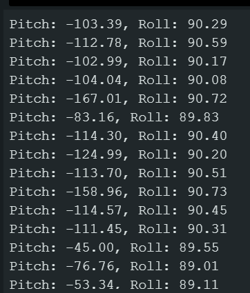

## IMU Setup
AD0_VAL represents the last bit of the I2C address. The default value for this is 1, and it should not be changed unless the ADR jumper is closed via solder to which it should then be set to 0. 

As the IMU is being rotated, you can see that the accelerometer and gyrometer print data as expected. All three axes for the sensors are printed along with their corresponding units. You can see accelerations and rotations being tracked and printed, but absolute position is not represented as changes in printed values only occur with movement. When rotating about the z-axis, the accelerometer does not change values but the gyrometer does and vice-versa for the x-axis. 

## Accelerometer

<figcaption>0° Pitch, 0° Roll</figcaption>

<figcaption>90° Pitch, 0° Roll</figcaption>

<figcaption>-90° Pitch, 0° Roll</figcaption>

<figcaption>0° Pitch, 90° Roll</figcaption>

<figcaption>0° Pitch, -90° Roll</figcaption>

## Gyrometer

## Sampling Data

## Stunt!
<iframe width="450" height="315" src="https://www.youtube.com/embed/pZPi5JXwBqw"allowfullscreen></iframe>
<figcaption>RC Car Stunt</figcaption>

The car is able to move very quickly with rapid accelerations. The traction of the car greatly depends on what surface you're driving on, and when driving on tile, there's very little traction. When driving fast, you can easily make the car flip and bounce around due to high speeds. 