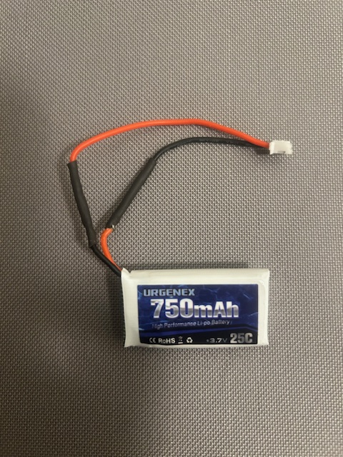
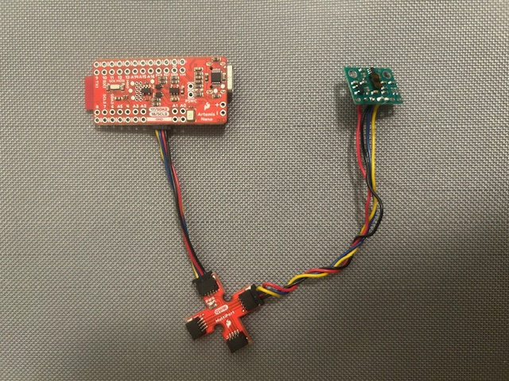

## Prelab
The goal of this lab was to set up the time of flight sensors prepare them for the RC car's use in detecting obstacles. By placing a sensor at the front of the car and one on the side, the car is able to detect obstacles in front of it as well as on the right side. This allows it to hve better understanding of where it can trun without needing to rotate 90° in order to check for obstacles. This does mean however, the car can't see anything behind as well as leaving the possibility for obstacles to be hit on the edges of the front. With the sensor in the middle of the front, it can't feel capture the width of the car. 

Both ToF sensors have the same I2C address of 0x52 according to the datasheet, so to use both of them, I had to change the address of one on the programs start or cycle the sensors on and off. I opted to change the address of one so I can gather data from the two sensors simultaneously. I also connected the sensors to the longer QWIIC cables so they can easil be placed in front and side fo the car, respectively, while the IMU is connected to a shorter cable. 

<figcaption>Schematic for Tof/IMU circuit. Note: a 850mAh battery is depicted but a 750mAh battery is used for the circuit.</figcaption>

## Battery Setup
I had to connect a JST connector to a 750mAh battery for use with the Artemis Nano. The black lead of the battery had to be solder to the red of the connector and the red lead to the black for it to connect to the Artemis correctly. Heat shrink was used to cover the solder connecting the battery to the JST connector.

<figcaption>Battery soldered to JST connector</figcaption>

## ToF Setup
I started by installing the SparkFun VL53L1X 4m laser distance sensor library and connecting the first ToF sensor to a QWIIC cable. I used a longer cable while referencing the datasheet to solder it, and the blue connected to SDA while the yellow connected to SCL. 

<figcaption>ToF sensor soldered and connected to QWIIC breakout and Artemis</figcaption>

I then ran the Example1_wire_I2C to test that the sensor was connected properly.

<figcaption>I2C address for the ToF sensor</figcaption>
This address is different from what I expected as the datasheet says the default is 0x52, but the example shows the address as 0x29. When looking at the binary values, you see 0x29 is 00101001 and 0x52 is 01010010. This shows that the value was shifted right by one bit, and this is due to the fact the least significant bit of the 0x52 address is used for read/write.

## ToF Testing
Next, I used Example1_ReadDistance to test the functionality of the ToF sensor. It has three distinct modes: short, medium, and long. Medium requires another library, so I focused on short and long. Short provides ranges up to 1.3m while long provides up to 4m. Long is very susceptible to ambient light according to the datasheet with it only allowing for ~0.7m under strong light. Short keeps its 1.3m range despite any strong light. Medium is very similar to long except its max range is shorter. These make short seem like the most relibale mode as the lighting conditions can be hard to control for the car. 

## Both ToF's

## ToF Execution Speed

## ToF and IMU Testing
